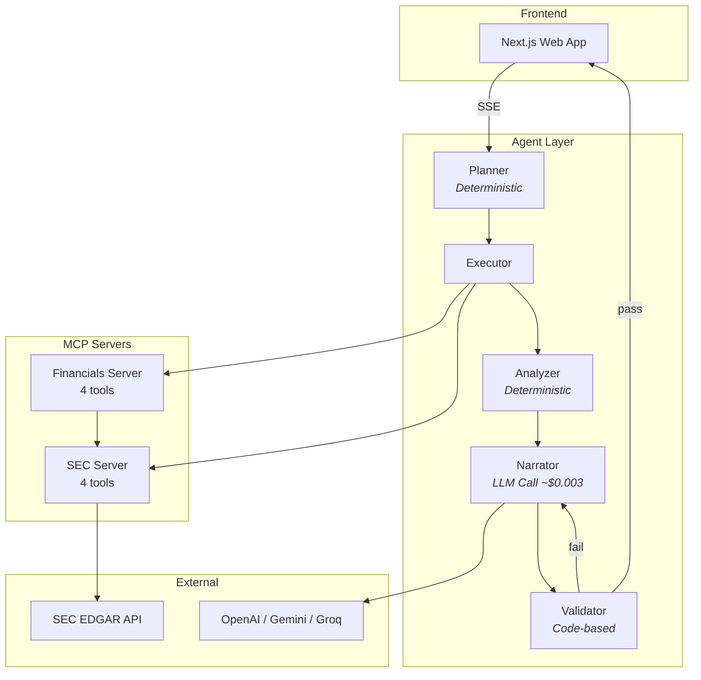

# Dolph

AI-powered SEC filing analyzer. Takes a stock ticker, retrieves real SEC filings from EDGAR, computes financial metrics, and generates a professional analysis report.

## Architecture



## Key Design Decisions

- **LLM usage is minimal**: Only 1-2 calls per analysis (~$0.003 with gpt-4o-mini). Planning, data fetching, ratio calculation, trend analysis, and validation are all deterministic code.
- **Three LLM providers**: OpenAI (default), Gemini (free tier), Groq (free tier) — switchable via env var.
- **MCP servers are standalone**: Each can be used independently with Claude Desktop, Cursor, or any MCP client.
- **All data from SEC EDGAR**: No third-party financial data APIs. Every number traces to a public filing.

## Project Structure

```
dolph/
├── packages/
│   ├── bootup/                  # Terminal splash animation
│   ├── shared/                  # Types, XBRL mappings, constants
│   ├── mcp-sec-server/          # MCP Server: SEC EDGAR access
│   ├── mcp-financials-server/   # MCP Server: Financial metrics
│   ├── agent/                   # Analysis pipeline orchestrator
│   └── web/                     # Next.js frontend
├── package.json
├── pnpm-workspace.yaml
└── .env.example
```

## Quick Start

```bash
# Clone and install
git clone <repo-url> dolph
cd dolph
pnpm install

# Configure
cp .env.example .env
# Edit .env with your API key and SEC User-Agent

# Build all packages
pnpm -r build

# Run the terminal animation
pnpm bootup

# Run analysis from CLI
pnpm --filter agent start AAPL

# Start the web frontend
pnpm dev
```

## Environment Variables

| Variable | Required | Default | Description |
|----------|----------|---------|-------------|
| `DOLPH_LLM_PROVIDER` | No | `openai` | `openai`, `gemini`, or `groq` |
| `DOLPH_LLM_MODEL` | No | `gpt-4o-mini` | Model ID for chosen provider |
| `DOLPH_OPENAI_API_KEY` | If using OpenAI | — | OpenAI API key |
| `DOLPH_GEMINI_API_KEY` | If using Gemini | — | Google AI API key |
| `DOLPH_GROQ_API_KEY` | If using Groq | — | Groq API key |
| `DOLPH_SEC_USER_AGENT` | Yes | — | SEC requires `"Name email@example.com"` |
| `DOLPH_CACHE_DIR` | No | `~/.dolph/cache` | Cache directory |

## Cost

~$0.003 per analysis with gpt-4o-mini. $0 with Gemini/Groq free tiers. You could run 300+ analyses for under $1.

## Tech Stack

- **Runtime**: Node.js, TypeScript (strict mode)
- **MCP**: @modelcontextprotocol/sdk
- **Frontend**: Next.js 14, Tailwind CSS, Recharts
- **LLM**: OpenAI SDK (also Gemini REST API, Groq API)
- **Parsing**: Cheerio (HTML), Zod (validation)

## License

MIT
